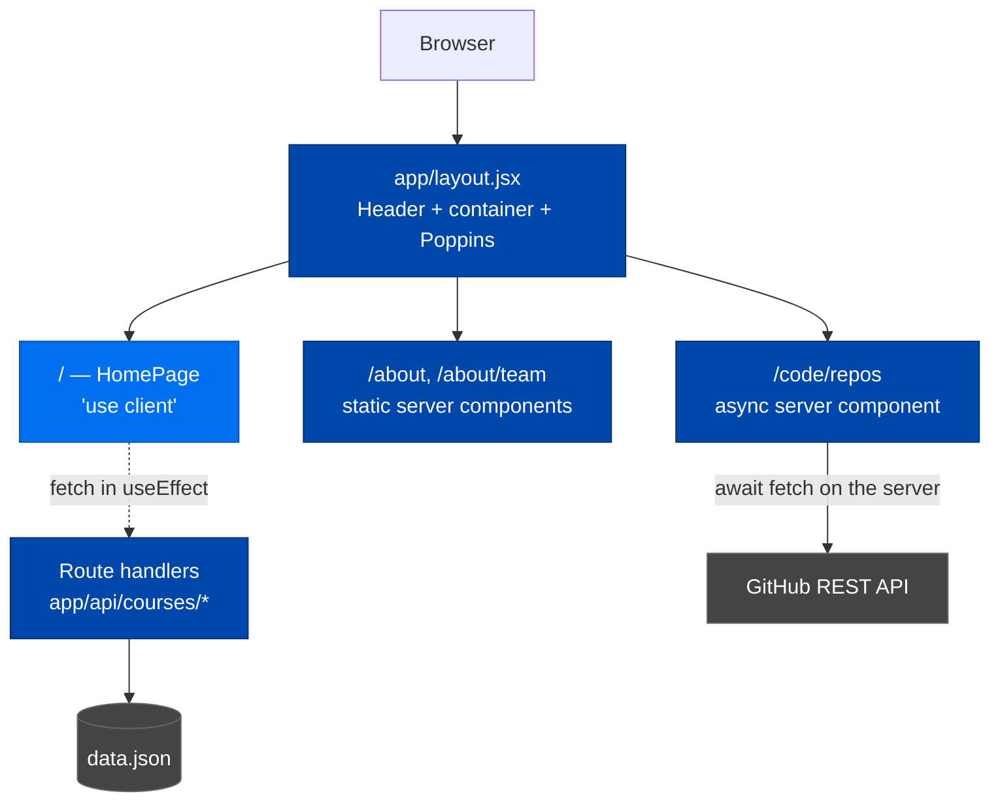
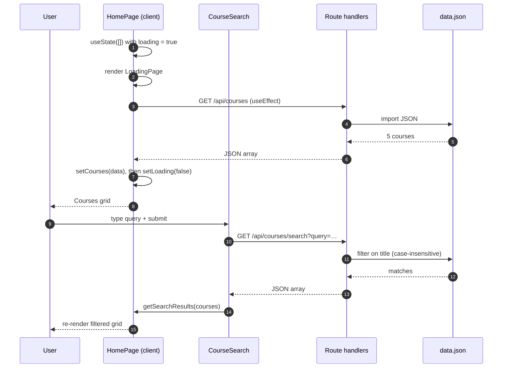
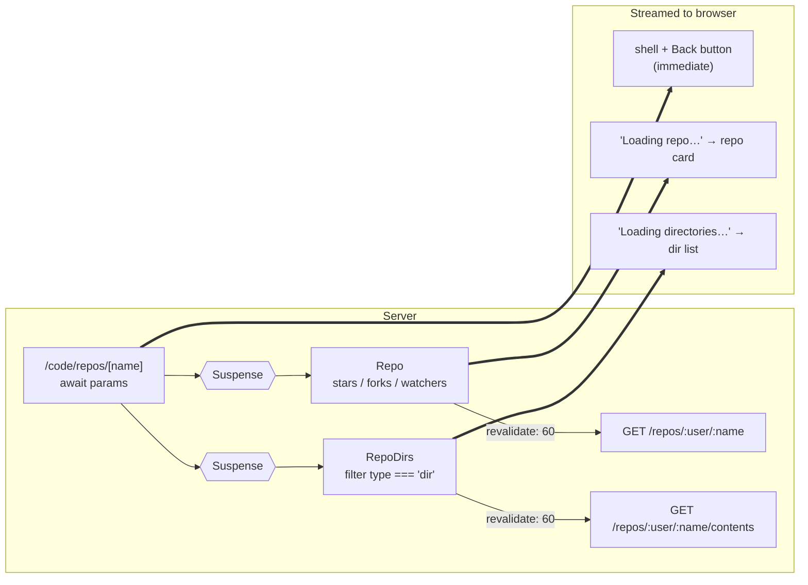
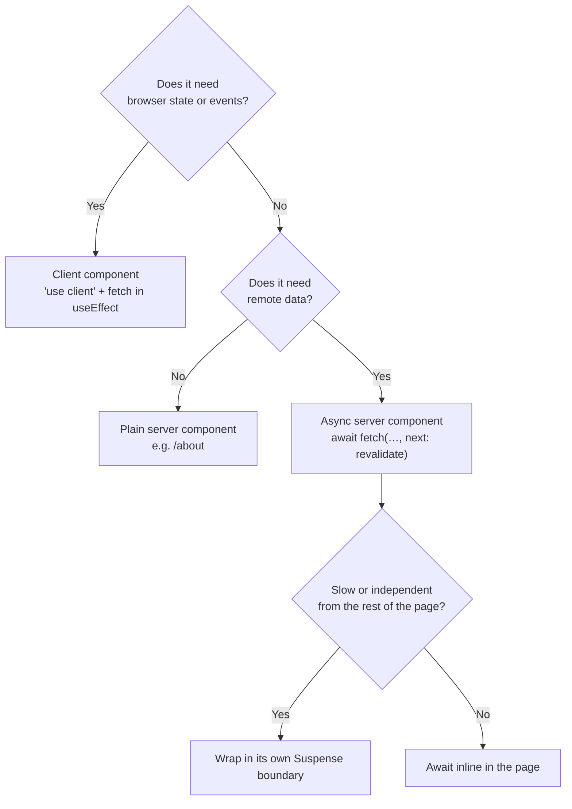

# Traversy Media — Next.js Course App

A small Next.js 16 App Router application that demonstrates two contrasting data-fetching
methodologies side by side in one codebase:

- **Courses** — client-side rendering against internal API route handlers
- **Repositories** — async React Server Components streaming live GitHub data

It is deliberately dependency-light (no TypeScript, no CSS framework, no state library) so the
rendering model stays visible rather than buried under tooling.

---

## Stack

| Concern | Choice |
| --- | --- |
| Framework | Next.js 16 (App Router) |
| UI | React 19 |
| Language | Plain JavaScript (`.jsx` / `.js`) |
| Styling | One global stylesheet, `app/globals.css` |
| Icons | `react-icons` (Font Awesome set) |
| IDs | `uuid` v4 for newly created courses |
| Fonts | Poppins via `next/font/google` |

Path alias: `@/*` → project root (`jsconfig.json`), e.g. `import Repo from '@/app/components/Repo'`.

---

## Getting Started

```bash
npm install
npm run dev      # http://localhost:3000
```

| Script | Purpose |
| --- | --- |
| `npm run dev` | Development server with hot reload |
| `npm run build` | Production build |
| `npm start` | Serve the production build |

There is no lint or test script in this project.

> **Note:** the repository pages call the unauthenticated GitHub API, which is rate limited to
> ~60 requests/hour per IP. All GitHub fetches use `revalidate: 60` to stay well inside that
> budget — keep that option on any new fetch you add.

---

## Routes

| Route | Rendering | Data source |
| --- | --- | --- |
| `/` | Client component | `GET /api/courses` |
| `/about` | Static server component | — |
| `/about/team` | Static server component | — |
| `/code/repos` | Async server component | GitHub `/users/:user/repos` |
| `/code/repos/[name]` | Async server component + streaming | GitHub `/repos/:user/:name` and `/contents` |
| `GET /api/courses` | Route handler | `app/api/courses/data.json` |
| `POST /api/courses` | Route handler | in-memory array (not persisted) |
| `GET /api/courses/search?query=` | Route handler | `data.json`, case-insensitive title match |

---

## Methodology

### High-level shape

Everything renders through the root layout, but the two feature areas take opposite paths to
their data — one resolves in the browser, one resolves on the server before HTML is sent.



### Pipeline 1 — Courses (client-side)

`app/page.jsx` carries the `'use client'` directive, so the page ships to the browser and
fetches after mount. `CourseSearch` owns the query input but not the results: it lifts search
results back to the page through a `getSearchResults` callback, which swaps the rendered list.



Because the page is a client component, `Courses` and `CourseSearch` are client components
**implicitly** — they intentionally declare no directive of their own.

### Pipeline 2 — Repositories (server-side + streaming)

The repo pages have no API layer. Server components `await` GitHub directly, and the detail page
splits its two calls into separate `<Suspense>` boundaries so the shell and back-link paint
immediately while each section streams in independently.



The GitHub username is currently hardcoded in three fetches
(`app/code/repos/page.jsx`, `app/components/Repo.jsx`, `app/components/RepoDirs.jsx`) — change
all three together.

### Rendering strategy at a glance



---

## Project Structure

```
app/
├── layout.jsx              root layout — Header, container, Poppins, metadata
├── page.jsx                '/' home page (client) — courses + search
├── loading.jsx             App Router loading UI, also rendered manually by page.jsx
├── globals.css             the entire stylesheet
├── about/
│   ├── page.jsx            '/about'
│   └── team/page.jsx       '/about/team'
├── api/courses/
│   ├── data.json           5 seed courses
│   ├── route.js            GET (list) + POST (create, in-memory)
│   └── search/route.js     GET ?query= title filter
├── code/repos/
│   ├── page.jsx            repository list
│   └── [name]/page.jsx     repository detail with two Suspense boundaries
└── components/
    ├── Header.jsx          nav
    ├── Courses.jsx         course card grid          (client, implicitly)
    ├── CourseSearch.jsx    search form               (client, implicitly)
    ├── Repo.jsx            single repo card          (async server)
    └── RepoDirs.jsx        top-level directory list  (async server)
```

`app/loading.jsx` does double duty: Next.js uses it as the automatic route-level loading UI, and
the client home page imports and renders it directly while its own fetch resolves.

---

## Styling

A single global stylesheet with plain semantic class names — `.card`, `.btn`, `.repo-list`,
`.search-form`, `.loader`. No CSS Modules, no utility framework, no component-scoped styles.
Add new rules to `app/globals.css` and reuse the existing classes. The dark theme's accent lives
in `--primary-color` on `:root`.

---

## Conventions

Commits follow Conventional Commits — `type(scope): subject`, imperative mood, under 60
characters, with `- ` bullets in the body:

```
feat(courses): add course search on home page

- add /api/courses/search route filtering on title
- lift results from CourseSearch into the home page
```

The repo ships a `/commit-msg` Claude Code skill (`.claude/skills/commit-msg/SKILL.md`) that
generates these from the staged diff. Per that convention, commits carry **no** `Co-Authored-By`
or generated-with trailers.

---

## Known Limitations

- `POST /api/courses` pushes onto the array imported from `data.json`. Nothing is written to
  disk, so new courses disappear on reload or rebuild. Real persistence needs an actual store.
- `RepoDirs` links to `/code/repos/[name]/[dir]`, a route that does not exist yet.
- `GET /api/courses/search` assumes `query` is present; an absent parameter throws.
- The GitHub username is hardcoded rather than read from an environment variable.
